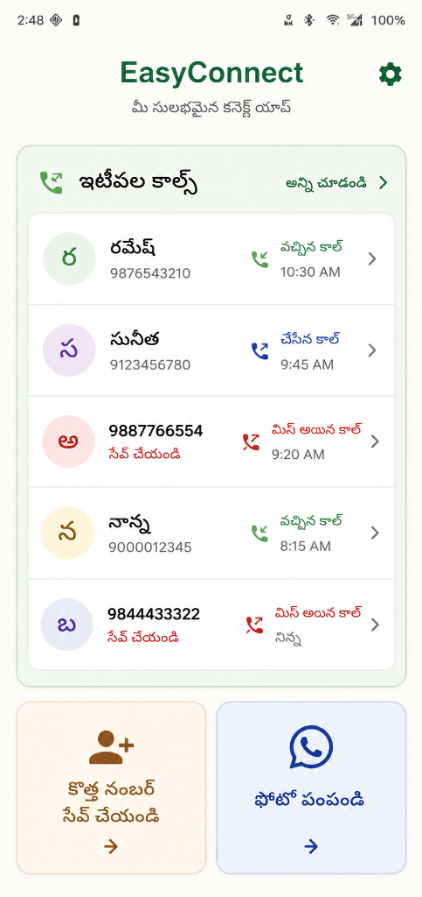
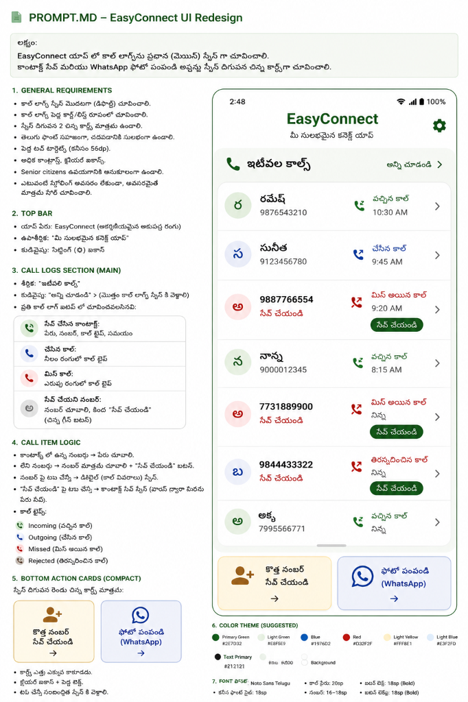
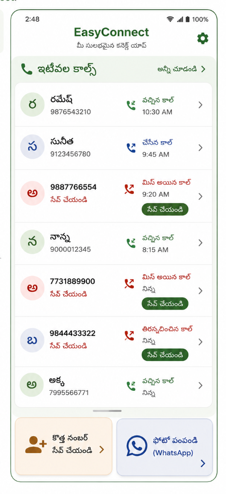
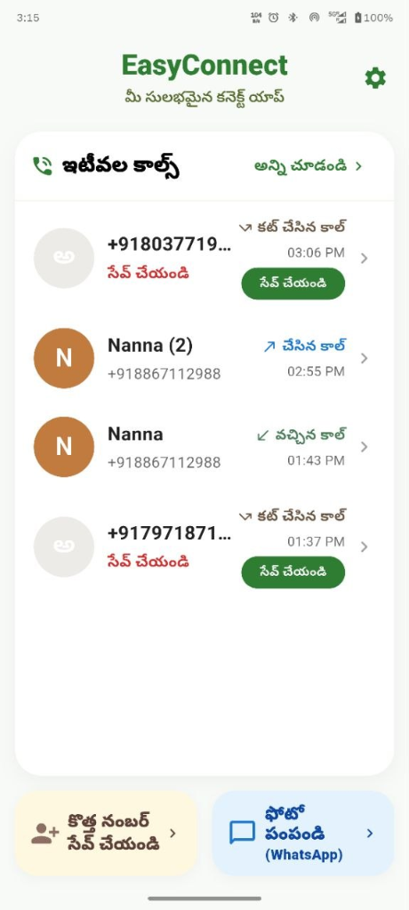
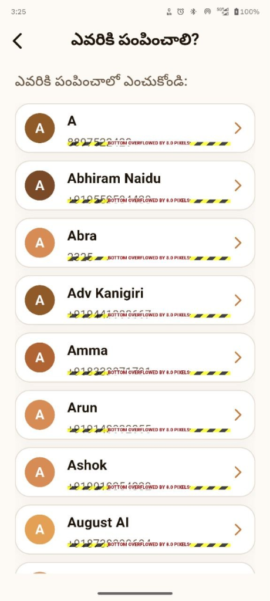
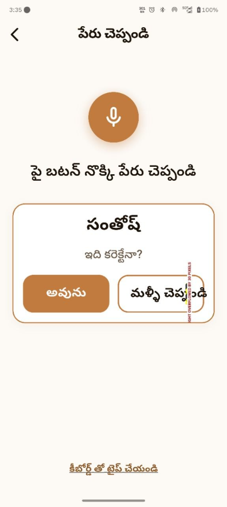

# EasySave (అమ్మానాన్న యాప్) 📱💖

EasySave is an elite, **Telugu-first, elderly-first, accessibility-first** Android smartphone assistant designed for non-literate and first-time smartphone users. The app streamlines calling, contact saving, and WhatsApp photo sharing into a calm, high-contrast, and highly intuitive interface requiring only **2–3 clicks** with **zero English typing**.

---

## 🌟 Visual Gallery

Below is a walkthrough of the EasySave interface designed specifically for elderly users:

| Main Dashboard (Home) | Dialpad (Telugu Cues) | Voice Saving Screen |
|:---:|:---:|:---:|
|  |  |  |

| Voice Result Screen | Photo Selection (WhatsApp) | Ready to Send (WhatsApp) |
|:---:|:---:|:---:|
|  |  |  |

---

## ✨ Core Pillars & Elite Features

### 🎙️ 1. Voice-First Contact Saving (2-3 Taps)
*   **Tactile Microphone Pulse:** A simple, high-visibility vertical microphone button records names natively under the Telugu `'te_IN'` locale.
*   **Sequence-Aware Deduplication:** Cleans repeating speech sequences (e.g. converting spoken `"సంతోష్ సంతోష్"` or `"రవి కుమార్ రవి కుమార్"` into a single, clean `"సంతోష్"` or `"రవి కుమార్"` name block) before displaying confirmation cards.
*   **Optimal Patience Tolerances:** Configured with a generous `20`-second total listening window and a smart `2`-second silence auto-stop trigger, accommodating slower speech patterns.
*   **Zero-Flicker States:** Instant provider status promotion directly binds speech captures to results, avoiding visual idle screen flashes during async native callbacks.

### ✉️ 2. Direct One-Tap WhatsApp Photo Sharing
*   **Bypasses Android System Share Sheet:** Skips the native share menu clutter entirely. Tapping a contact immediately launches WhatsApp directly inside that contact's chat with the media already attached, ready to send.
*   **Secure FileProvider Integration:** Uses Android's secure `FileProvider` (`content://` URIs) to package image gallery or camera snap assets safely before cross-app intent dispatching.
*   **Automatic Number Normalization:** Sanitizes phone numbers on the fly, automatically appending international country prefixes (e.g., prepending `"91"` for standard 10-digit Indian numbers) to guarantee JID matching.

### 📞 3. Call Log History & Quick Voice-Save
*   **Grouped History:** Lazy-loads up to 500 consecutive logs, grouping duplicates (e.g. `"రమేష్ (3 కాల్స్)"` instead of three lines) to reduce cognitive load and visual clutter.
*   **Instant Unsaved Save:** Unknown numbers display a massive `"సేవ్ చేయండి"` CTA that directs straight to the voice-first name capture wizard.

### ⚙️ 4. Android 16 (API 36) Cloud-Safe Storage
*   **Zero-Crash Guarantee:** Resolves the modern Android 16 blocker (`IllegalArgumentException` when the default saving account is Cloud).
*   **Native Kotlin Bridge:** [MainActivity.kt](file:///android/app/src/main/kotlin/com/ammananna/app/MainActivity.kt) intercepts local database insert blocks, automatically queries available account authenticators, and writes contacts directly to the active Google/cloud account.
*   **Automated System Fallback:** Gracefully falls back to the native editor form (`openExternalInsert`) if programmatic insertions fail, ensuring absolute crash-resilience.

---

## ♿ Accessibility & UX Design System

*   **TalkBack Semantic Dictionary:** Keypad digit buttons report highly descriptive Telugu cues (e.g., `"అంకె ఒకటి"` for `1`, `"అంకె సున్నా"` for `0`) instead of fast raw digits.
*   **Ultra-Tactile Boundaries:** Bounding boxes, card paddings, and button vertical boundaries are locked to a minimum of **`72dp`** to accommodate motor-challenged target users.
*   **Responsive Typography:** Custom Noto Sans Telugu typeface is used globally to prevent character block rendering (`"tofu"` box display) on low-end budget hardware.
*   **Auto-Scaling Buttons:** Core action buttons (`EasyButton`) utilize `Flexible` and `FittedBox` scale-down constraints to automatically resize long scripts (e.g., `"మళ్ళీ చెప్పండి"`) and completely avoid visual layout overflows on all screen dimensions.

---

## 🛠️ Architecture & Tech Stack

EasySave is built following a clean, unidirectional data flow architecture using modern state management and clean coding patterns:

```
lib/
├── models/          # Immutable data structures (Contact, CallLog)
├── repository/      # Data access interfaces & Concrete Native Repository implementations
├── services/        # Hardware APIs (Speech-To-Text, Media Pickers, WhatsApp Intent Service)
├── providers/       # State Notifiers & Dynamic dependency injection (Riverpod)
├── routing/         # Safe linear slide-transition routes (GoRouter)
├── theme/           # Curated accessible design tokens (Warm mustard, Turmeric, Sandstones)
├── widgets/         # Reusable highly accessible widgets (Tactile buttons, SnackBar modules)
└── screens/         # Simplified view flows (Home, Dialer, PhotoSharer, ContactSaver)
```

*   **Framework:** Flutter (v3.44.0 SDK)
*   **State Management:** Flutter Riverpod (v2.5.1)
*   **Routing:** GoRouter (v14.2.0)
*   **Permissions Handling:** Permission Handler (v11.3.0)
*   **Hardware APIs:** speech_to_text, image_picker, call_log, share_plus

---

## 🚀 Getting Started

### 📋 Prerequisites
*   Flutter SDK `3.44.0` (or compatible)
*   Android SDK 36 (targetSdk 36)
*   Java Development Kit (JDK 17)

### 💻 Installation
1. Clone the repository:
   ```bash
   git clone https://github.com/santjsx/EasySave.git
   cd EasySave
   ```
2. Retrieve dependencies:
   ```bash
   puro flutter pub get
   ```
3. Run the automated test suite to verify baseline integrity:
   ```bash
   puro flutter test
   ```
4. Build the debug APK or run directly on your connected target device:
   ```bash
   puro flutter run -d <YOUR_DEVICE_ID>
   ```

---

## 🛡️ License
Distributed under the MIT License. See `LICENSE` for more information.
